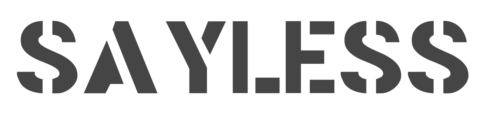

# SAYLESS

**Remix your world**

From the terminal to the turntables, indie dance with purpose.

## Find Me

- **Web**: [justsayless.xyz](https://justsayless.xyz)
- **Instagram**: [@justsayless](https://instagram.com/justsayless)
- **SoundCloud**: [just-say-less](https://soundcloud.com/just-say-less)

## What's Here

This repo is the open-source home of SAYLESS - branding, philosophy, arsenal. 

Follow the rabbit:
- `entrance.html` - Start here
- `brand/` - Visual identity and philosophy docs
- `sound/` - Production notes (some encrypted, some not)
- `logo/` - Official marks

## Philosophy

I'll remix anything, but don't take my word for it. Pay attention.

## Tech Stack

- Static HTML for the website
- Ableton for music production
- Recordbox for performance creation

## Font

`fonts/StencilGothic.ttf`

## Logo

`logo/` directory contains:
- `SAYLESS-TRANSPARENT.png` - Transparent background
- `SAYLESS-BLACK-BG.png` - Black background
- `SAYLESS.png` - White background

---

*Making marks, not advertisements*
